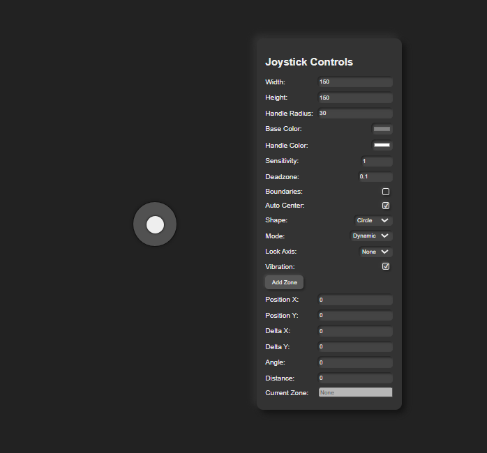

# Virtual Joystick

A customizable, touch-friendly virtual joystick implementation for web applications.


## Interactive Demo

Try out the Virtual Joystick right here:

<iframe src="https://joker-pyc.github.io/Virtual-Joystick/" width="100%" height="500" frameborder="0"></iframe>

*Note: If the demo doesn't appear above, you can view it [here](https://joker-pyc.github.io/Virtual-Joystick/).*

---

## 📖 Description

The **Virtual Joystick** module is an open-source project that provides a flexible and easy-to-use joystick interface for web applications. It is particularly useful for:

- Web-based games
- Simulations
- Robotics control interfaces
- Any application that requires directional input.

## ✨ Features

- 🎮 **Highly Customizable Appearance:**
    -   Size (width, height)
    -   Colors (base, handle)
    -   Handle radius
    -   Shape (circle or square)
    -   Neumorphic styling options (theme)
- 🖱️ **Supports Mouse and Touch Events**
- ⚡ **Real-time Position Feedback:**
    -   `onChange` event with position, delta, angle, distance, and active zone information.
- 🔄 **Multiple Modes:**
    -   `dynamic`: Joystick appears where the user touches.
    -   `static`: Joystick is fixed in a position.
- 📐 **Axis Locking:**
    -   Option to lock movement to the X or Y axis.
- 🎯 **Customizable Zones:**
    -   Define circular zones with `min` and `max` distance thresholds.
    -   `onChange` event reports the active zone.
    -   Optional vibration on zone change (if supported by the browser).
- 🎛️ **Deadzone:**
    -   Configurable deadzone to prevent unintended small movements.
- ↩️ **Auto-Centering:**
    -   Option to automatically return the handle to the center when released.
- 🔌 **Easy Integration:**
    -   Import the `VirtualJoystick` class and use it in your web project.
- 📱 **Responsive Design:**
    -   Adapts to different screen sizes for mobile and desktop.
- 🛠️ **Lifecycle Events:**
    -   `onStart` event: Triggered when the user starts interacting with the joystick.
    -   `onEnd` event: Triggered when the user stops interacting with the joystick.

## 📦 Installation

To use the **Virtual Joystick** in your project, follow these steps:

1. Download the `VirtualJoystick.js` file from this repository.
2. Place it in your project directory.
3. Import it into your JavaScript file as follows:

```javascript
import VirtualJoystick from './path/to/VirtualJoystick.js';
```

## 🚀 Usage Example

Here’s how you can create and use a **Virtual Joystick** in your web app:

```javascript
// Get the container element where the joystick will be rendered
const container = document.getElementById('joystick-container');

// Create a new VirtualJoystick instance with options
const joystick = new VirtualJoystick(container, {
    width: 150,
    height: 150,
    handleRadius: 30,
    color: '#808080', // Base color
    handleColor: '#ffffff', // Handle color
    sensitivity: 1,
    deadzone: 0.1,
    boundaries: false,
    autoCenter: true,
    shape: 'circle',
    mode: 'dynamic',
    lockAxis: null, // or 'x' or 'y'
    vibration: true,
    zones: [
        { id: 'zone-1', color: '#ff000050', min: 0.2, max: 0.5 },
        { id: 'zone-2', color: '#00ff0050', min: 0.5, max: 0.8 }
    ],
    theme: {
        base: {
            background: 'rgba(128, 128, 128, 0.5)',
            border: '3px solid rgba(0, 0, 0, 0.8)',
            shadow: '0 0 10px rgba(0, 0, 0, 0.3)'
        },
        handle: {
            background: 'rgba(255, 255, 255, 0.9)',
            border: '2px solid rgba(0, 0, 0, 0.8)',
            shadow: '0 0 5px rgba(0, 0, 0, 0.5)'
        }
    },
    onChange: (data) => {
        console.log('Joystick Data:', data);
        // Access position, delta, angle, distance, zone
    },
    onStart: () => {
        console.log('Joystick interaction started');
    },
    onEnd: () => {
        console.log('Joystick interaction ended');
    }
});
```

## 🎨 Customization Options

The **Virtual Joystick** is highly customizable. Here's a visual representation of the options:




## ⚙️ Options Table

| Option        | Type     | Default               | Description                                                                                                                                  |
| :------------ | :------- | :-------------------- | :------------------------------------------------------------------------------------------------------------------------------------------- |
| `width`       | number   | 100                   | Width of the joystick base.                                                                                                                 |
| `height`      | number   | 100                   | Height of the joystick base.                                                                                                                |
| `color`       | string   | 'gray'                | Background color of the joystick base (deprecated, use `theme.base.background`).                                                          |
| `handleColor` | string   | 'white'               | Color of the joystick handle (deprecated, use `theme.handle.background`).                                                                   |
| `handleRadius`| number   | 20                    | Radius of the joystick handle.                                                                                                              |
| `onChange`    | function | null                  | Callback function triggered when the joystick position changes. Receives an object with `position`, `delta`, `angle`, `distance`, and `zone`. |
| `onStart`     | function | null                  | Callback function triggered when the user starts interacting with the joystick.                                                              |
| `onEnd`       | function | null                  | Callback function triggered when the user stops interacting with the joystick.                                                             |
| `sensitivity` | number   | 1                     | Sensitivity of the joystick. Higher values make it more sensitive.                                                                       |
| `boundaries`  | boolean  | false                 | If `true`, the handle will be constrained within the base.                                                                               |
| `autoCenter`  | boolean  | true                  | If `true`, the handle returns to the center when released.                                                                                 |
| `deadzone`    | number   | 0.1                   | The area around the center where input is ignored (normalized, 0 to 1).                                                                   |
| `shape`       | string   | 'circle'              | Shape of the joystick base: 'circle' or 'square'.                                                                                           |
| `mode`        | string   | 'dynamic'             | Joystick mode: 'dynamic' (appears at touch point) or 'static' (fixed position).                                                          |
| `lockAxis`    | string   | null                  | Lock movement to an axis: null, 'x', or 'y'.                                                                                              |
| `zones`       | array    | \[ ]                  | Array of zone objects. Each zone: `{ id: string, color: string, min: number, max: number }`.                                                 |
| `vibration`   | boolean  | true                  | If `true`, the device will vibrate on zone changes (if supported).                                                                       |
| `theme`       | object   | { base: {}, handle: {} } | Neumorphic theme options. `base`: background, border, shadow. `handle`: background, border, shadow.                                       |

## 📊 Events

-   **`onChange(data)`:**
    -   Triggered continuously while the joystick handle is being moved.
    -   `data` object:
        -   `position: { x, y }` (absolute position within the base)
        -   `delta: { x, y }` (normalized position, -1 to 1)
        -   `angle` (in radians)
        -   `distance` (from the center)
        -   `zone` (ID of the active zone or null)
-   **`onStart()`:**
    -   Triggered once when the user begins interacting with the joystick (mousedown or touchstart).
-   **`onEnd()`:**
    -   Triggered once when the user stops interacting with the joystick (mouseup or touchend).

```javascript
// Example usage of onChange event
onChange: (data) => {
    console.log(`X: ${data.delta.x.toFixed(2)}, Y: ${data.delta.y.toFixed(2)}`);
    console.log(`Angle: ${data.angle.toFixed(2)}, Distance: ${data.distance.toFixed(2)}`);
    console.log(`Active Zone: ${data.zone || 'None'}`);
}
```

## 📝 License

This project is licensed under the [MIT License](LICENSE). Feel free to use, modify, and distribute it.

## 👤 Author

Created by **Santosh Maurya**.

## 🤝 Contributing

Contributions are welcome! If you'd like to report an issue or request a feature, please visit the [issues page](https://github.com/Joker-দ্‌PyC/Virtual-Joystick/issues).

## 📧 Support

If you have any questions, feel free to [open an issue](https://github.com/Joker-PyC/Virtual-Joystick/issues/new) in the project repository.

---

Made with ❤️ by developers, for developers.

---


