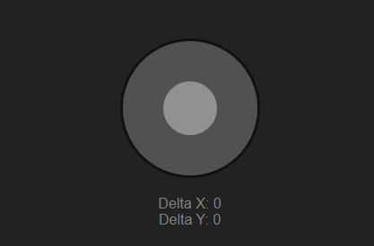

---

# Virtual Joystick

A customizable, touch-friendly virtual joystick implementation for web applications.



## Interactive Demo

Try out the Virtual Joystick right here:

<iframe src="https://joker-pyc.github.io/Virtual-Joystick/" width="100%" height="400" frameborder="0"></iframe>

*Note: If the demo doesn't appear above, you can view it [here](https://joker-pyc.github.io/Virtual-Joystick/).*

---

## 📖 Description

The **Virtual Joystick** module is an open-source project that provides a flexible and easy-to-use joystick interface for web applications. It is particularly useful for:

- Web-based games
- Simulations
- Any application that requires directional input.

## ✨ Features

- 🎮 **Customizable appearance** (size, colors, etc.)
- 🖱️ **Supports mouse and touch events**
- ⚡ **Real-time position feedback**
- 🔌 **Easy integration** into existing web projects
- 📱 **Responsive design** for mobile and desktop

## 📦 Installation

To use the **Virtual Joystick** in your project, follow these steps:

1. Download the `VirtualJoystick.js` file from this repository.
2. Place it in your project directory.
3. Import it into your JavaScript file as follows:

```javascript
import VirtualJoystick from './path/to/VirtualJoystick.js';
```

## 🚀 Usage Example

Here’s how you can create and use a **Virtual Joystick** in your web app:

```javascript
// Get the container element where the joystick will be rendered
const container = document.getElementById('joystick-container');

// Create a new VirtualJoystick instance
const joystick = new VirtualJoystick(container, {
    width: 150,
    height: 150,
    color: 'lightblue',
    handleColor: 'blue',
    handleRadius: 35,
    onChange: (delta) => {
        console.log(`Joystick position: x=${delta.x}, y=${delta.y}`);
    }
});
```

## 🎨 Customization Options

The **Virtual Joystick** is highly customizable. Here are the available options and how they affect the appearance:

```
┌─────────────────────┐
│         │           │
│   ┌─────┼─────┐     │ ← Joystick base (color)
│   │     │     │     │
│   │  ┌──┴──┐  │     │
│   │  │     │  │     │ ← Handle (handleColor, handleRadius)
│   │  └──┬──┘  │     │
│   │     │     │     │
│   └─────┼─────┘     │
│         │           │
└─────────────────────┘
     ↑         ↑
   width     height
```

## ⚙️ Options Table

| Option        | Type     | Default | Description                                    |
|---------------|----------|---------|------------------------------------------------|
| `width`       | number   | 100     | Width of the joystick base                     |
| `height`      | number   | 100     | Height of the joystick base                    |
| `color`       | string   | 'gray'  | Background color of the joystick base          |
| `handleColor` | string   | 'white' | Color of the joystick handle                   |
| `handleRadius`| number   | 20      | Radius of the joystick handle                  |
| `onChange`    | function | null    | Callback function receiving joystick position  |

## 📊 Events

The `onChange` callback is triggered whenever the joystick’s position changes. The callback receives a `delta` object with `x` and `y` values ranging from -1 to 1, representing the joystick's position relative to its center.

```javascript
onChange: (delta) => {
    console.log(`X: ${delta.x.toFixed(2)}, Y: ${delta.y.toFixed(2)}`);
}
```

## 📝 License

This project is licensed under the [MIT License](LICENSE). Feel free to use, modify, and distribute it.

## 👤 Author

Created by **Santosh Maurya**.

## 🤝 Contributing

Contributions are welcome! If you'd like to report an issue or request a feature, please visit the [issues page](https://github.com/yourusername/virtual-joystick/issues).

## 📧 Support

If you have any questions, feel free to [open an issue](https://github.com/yourusername/virtual-joystick/issues/new) in the project repository.

---

Made with ❤️ by developers, for developers.

---
